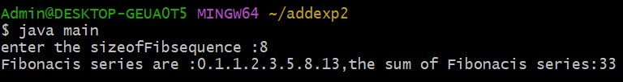
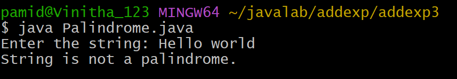
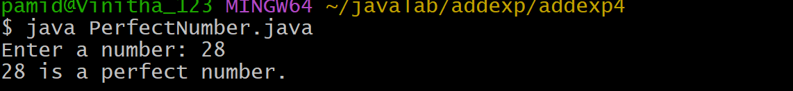

#  ADDITIONAL EXPERIMENT-2:
## 2)Title: Sum of the first nFibonacci numbers.
## source code:
```java
class Fibonacis {
    int firstNumber;
    int secondNumber;
    int thirdNumber;
    int sum;
    int sizeofFibsequence;
    Fibonacis(int size) {
    firstNumber =0;
    secondNumber =1;
    thirdNumber =0;
    sum =0;
    sizeofFibsequence=size;
   }
    void generateFibsequence() {
      while(sizeofFibsequence>0) {
       if(sizeofFibsequence>1)
    System.out.print(firstNumber +".");
    else
    System.out.print(firstNumber +",");
    sizeofFibsequence--;
    sum+=firstNumber;
    thirdNumber=firstNumber+secondNumber;
    firstNumber=secondNumber;
    secondNumber=thirdNumber;
   }
  }
    int getFibsum() {
      if(sum>0)
      return sum;
    else {
      generateFibsequence();
       return sum;
   }
  }
}
import java.util.Scanner;
  class main {
   public static void main(String args[]) {
  System.out.print("enter the sizeofFibsequence :");
    Scanner sc=new Scanner(System.in);
    int size =sc .nextInt();
       if(size>0) {
    Fibonacis Fib =new Fibonacis(size);
  System.out.print("Fibonacis series are :");
     Fib.generateFibsequence();
  System.out.println("the sum of Fibonacis series:"+ Fib.getFibsum());
  else
  System.out.println("Fibonacis sequence and sum can not be calculate");
 }
}
```
# output:


## Additional Experiment-1
## 1) Title:To Insert a SubString into a given Main String form a given Position.
## Source Code:
``` java
import java.util.Scanner;
class SubStringInsert {
    public static void main(String[] args) {
        String mainString, subString;
        int position;
        Scanner sc = new Scanner(System.in);
        System.out.print("Enter the main string: ");
        mainString = sc.nextLine();
        System.out.print("Enter the sub string: ");
        subString = sc.nextLine();
        System.out.print("Enter the position: ");
        position = sc.nextInt();
        int length = mainString.length();
        String resultString;
        if (position >= 0 && position <= length) {
            String firstPart = mainString.substring(0, position);
            String secondPart = mainString.substring(position);
            resultString = firstPart + subString + secondPart;
            System.out.println("Resultant String = " + resultString);
        }
        else {
            System.out.println("Substring is not possible to insert");
            System.out.println("Condition: 0 <= position <= length of main string");
        }
        sc.close();
    }
```
# output:


## Additional Experiment-3
## 3)Title: To determine if a given number is palindrome or not.
## Source Code:
```java
import java.util.Scanner;
class Palindrome {
    public static void main(String[] args) {
        String str;
        Scanner sc = new Scanner(System.in);
        System.out.print("Enter the string: ");
        str = sc.nextLine();
        int start = 0;
        int end = str.length() - 1;
        boolean flag =true;
        while (start < end) {
            if (str.charAt(start) != str.charAt(end)) {
                System.out.println("String is not a palindrome.");
                flag = false;
                break;
            }
            start++;
            end--;
        }
        if (flag) {
            System.out.println("String is a palindrome.");
        }
        sc.close();
    }
}
```
# output:


## Additional Experiment-4
## 4)Title:To check if a number is a Perfect number:
## Source Code:
``` java
import java.util.Scanner;
public class PerfectNumber {
    public static void main(String[] args) {
        int num, sum = 0;
        Scanner sc = new Scanner(System.in);
        System.out.print("Enter a number: ");
        num = sc.nextInt();
        for (int i = 1; i < num; i++) {
            if (num % i == 0) {
                sum = sum + i;
            }
        }
        if (sum == num) {
            System.out.println(num + " is a perfect number.");
        } else {
            System.out.println(num + " is not a perfect number.");
        }
        sc.close();
    }
}
```
# output:

