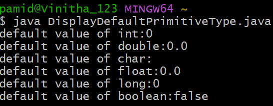
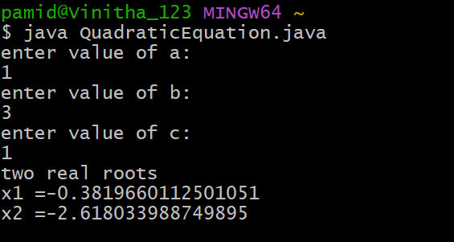
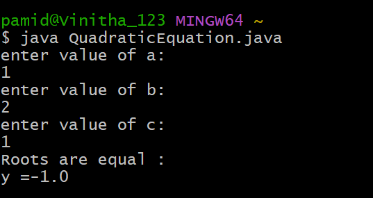
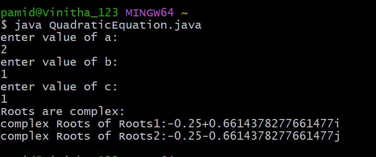

# EXPERIMENT-1:
## 1a) Title: Displaying Default Primitive Types
```java
class DisplayDefaultPrimitiveType {
  int printInt;
  double printDouble;
  float printFloat;
  char printChar;
  long printLong;
  boolean printBoolean;
  public static void main(String[] args) {
    DisplayDefaultPrimitiveType dpt = new DisplayDefaultPrimitiveType();
    System.out.println("Default value of int: " + dpt.printInt);
    System.out.println("Default value of double: " + dpt.printDouble);
    System.out.println("Default value of float: " + dpt.printFloat);
    System.out.println("Default value of char: " + dpt.printChar);
    System.out.println("Default value of long: " + dpt.printLong);
    System.out.println("Default value of boolean: " + dpt.printBoolean);
  }
}
```
# output:

# 1b) Title: Find the Roots of Quadrdtic Equation
```java
import java.util.Scanner;
class QuadraticEquation {
    public static void main(String[] args ) {
    Scanner sc =new Scanner(System.in);
    System.out.println("enter value of a:");
    double a= sc.nextDouble();
    System.out.println("enter value of b:");
    double b= sc.nextDouble();
    System.out.println("enter value of c:");
    double c= sc.nextDouble();
    double D= b*b-4*a*c;
     if(D>0) {
     double x1 = (-b + Math.sqrt(D))/(2*a);
     double x2 =(-b - Math.sqrt(D))/(2*a);
     System.out.println("two real roots");
     System.out.println("x1 =" +x1);
     System.out.println("x2 =" +x2);
}
  else if(D==0){
      double y= (-b/(2*a));
      System.out.println("Roots are equal :");
      System.out.println("y =" +y);
}
   else if(D<0) {
        double z= -b/(2*a);
        double img1 =Math.sqrt(-D)/(2*a);
        System.out.println("Roots are complex:");
        System.out.println("complex Roots of Roots1:" +z+ "+" +img1+"i");
        System.out.println("complex Roots of Roots2:" +z+"-"+img1+"j");
}
 else {
       System.out.println("Invalid choice:");
}
}
}
```
## output:





