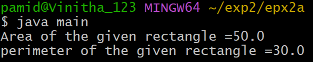
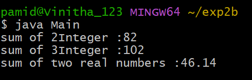

# EXPERIMRNT-2
## 2a) Title: Implement class mechanism in java. create a class ,methods and invoke them inside the method.
## source code;
```java
 class Rectangle {
      double length;
      double breadth;
      double area() {
          return length * breadth;
      }

      double perimeter() {
      return 2*(length +breadth);
}
}
class Main {
  public static void main(String args[]) {
    Rectangle rect = new Rectangle();
         rect.length = 10;
         rect.breadth = 5;
    double area = rect.area();
    double perimeter = rect.perimeter();
    System.out.println("Area of the given rectangle =" + area);
    System.out.println("perimeter of the given rectangle =" + perimeter);
 }
}
```
## output:


## 2b) Title: write a java program implement overloading.
## source code;
```java
class Sum {
    int sum(int a,int b) {
        return a+b;
     }
     int sum(int a,int b ,int c){
      return a+b+c;
      }
     double sum(double a,double b){
       return a+b;
}
}
class Main {
  public static void main(String[] args) {
   Sum s = new Sum();
   System.out.println("sum of 2Integer :" +s.sum(36,46));
   System.out.println("sum of 3Integer :" +s.sum(20,36,46));
   System.out.println("sum of two real numbers :" +s.sum(30.465,15.675));
}
}
```
## output:


## 2c) Title: write a java program to implement constructer.
## source code;
```java
class student {
  String sname;
  int sage;
  double smarks;
  student(String name, int age, double marks) {
    sname = name;
    sage = age;
    smarks = marks;
  }
  void display() {
    System.out.println("Student name: " + sname);
    System.out.println("Student age: " + sage);
    System.out.println("Student marks: " + smarks);
  }
}
class main {
  public static void main(String[] args) {
    student s = new student("dhanush",18,980);
    s.display();
  }
}
```
## output:

