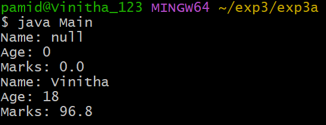
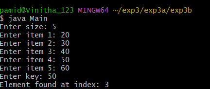
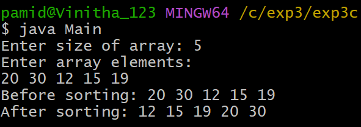

# EXPERIMENT-3:
## 3a) Title:Implement Constructor overloading in java.
## source code:
```java
class Student {
    String name;
    int age;
    double marks;

    Student() {
    }

    Student(String name, int age, double marks) {
        this.name = name;
        this.age = age;
        this.marks = marks;
    }

    void display() {
        System.out.println("Name: " + name);
        System.out.println("Age: " + age);
        System.out.println("Marks: " + marks);
    }
}

class Main {
    public static void main(String[] args) {
        Student std = new Student();
        std.display();
        Student std1 = new Student("Vinitha", 18, 96.8);
        std1.display();
    }
}
```
# output:


## 3b) Title: Implementing Binary Search Algorithm.
## soure code:
```java
import java.util.Scanner;
class BinarySearch {
    int[] list;
    int size;
    BinarySearch(int size) {
        this.size = size;
        list = new int[size];
    }
    void setList() {
        Scanner sc = new Scanner(System.in);
        for (int i = 0; i < size; i++) {
            System.out.print("Enter item " + (i + 1) + ": ");
            list[i] = sc.nextInt();
        }
    }
    int binarySearch(int key) {
        int low = 0, high = size - 1;
        while (low <= high) {
            int mid = (low + high) / 2;
            if (list[mid] == key)
                return mid;
            else if (list[mid] < key)
                low = mid + 1;
            else
                high = mid - 1;
        }
        return -1;
    }
}
import java.util.Scanner;
class Main {
    public static void main(String[] args) {
        Scanner sc = new Scanner(System.in);
        System.out.print("Enter size: ");
        int size = sc.nextInt();
        BinarySearch bs = new BinarySearch(size);
        bs.setList();  
        System.out.print("Enter key: ");
        int key = sc.nextInt();
        int index = bs.binarySearch(key);
        if (index == -1)
            System.out.println("Element not found");
        else
            System.out.println("Element found at index: " + index);
    }
}
```
# output:


## 3c)Title: Sorting element using Bubble sort.
# Source code:
```java
class BubbleSort {
    int arr[];
    int size;
    BubbleSort(int size) {
        this.size = size;
        arr = new int[size];
    }
    void setArray() {
        Scanner sc = new Scanner(System.in);
        System.out.println("Enter array elements:");
        for (int i = 0; i < size; i++) {
            arr[i] = sc.nextInt();
        }
    }
    void sort() {
        int temp;
        for (int i = 0; i < size - 1; i++) {
            for (int j = 0; j < size - 1 - i; j++) {
                if (arr[j] > arr[j + 1]) {
                    temp = arr[j];
                    arr[j] = arr[j + 1];
                    arr[j + 1] = temp;
                }
            }
        }
    }
    void display() {
        for (int i = 0; i < size; i++) {
            System.out.print(arr[i] + " ");
        }
        System.out.println();
    }
}

import java.util.Scanner;
class Main {
    public static void main(String args[]) {

        Scanner sc = new Scanner(System.in);
        System.out.print("Enter size of array: ");
        int n = sc.nextInt();
        BubbleSort bs = new BubbleSort(n);
        bs.setArray();
        System.out.print("Before sorting: ");
        bs.display();
        bs.sort();
        System.out.print("After sorting: ");
        bs.display();
    }
}
```
# output:


    void display() {
        for (int i = 0; i < size; i++) {
            System.out.print(arr[i]
