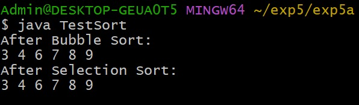
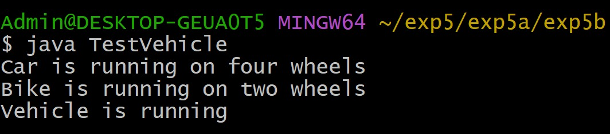
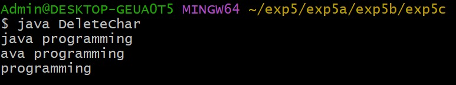

# EXPERIMENT-5
## 5a)Title: Implement Interface
## Source Code:
```java
interface Sortable {
    void sort(int arr[]);
}
class BubbleSort implements Sortable {
    public void sort(int arr[]) {
        int n = arr.length;
        for (int i = 0; i < n - 1; i++) {
            for (int j = 0; j < n - i - 1; j++) {
                if (arr[j] > arr[j + 1]) {
                    int temp = arr[j];
                    arr[j] = arr[j + 1];
                    arr[j + 1] = temp;
                }
            }
        }
    }
}
class SelectionSort implements Sortable {
    public void sort(int arr[]) {
        int n = arr.length;
        for (int i = 0; i < n - 1; i++) {
            int min = i;
            for (int j = i + 1; j < n; j++) {
                if (arr[j] < arr[min]) {
                    min = j;
                }
            }
            int temp = arr[min];
            arr[min] = arr[i];
            arr[i] = temp;
        }
    }
}
class TestSort {
    static void display(int arr[]) {
        for (int ele : arr) {
            System.out.print(ele + " ");
        }
        System.out.println();
    }
    public static void main(String args[]) {
        int arr[] = {9, 7, 4, 3, 6, 8};
        Sortable s;
        s = new BubbleSort();
        s.sort(arr);
        System.out.println("After Bubble Sort:");
        display(arr);
        s = new SelectionSort();
        s.sort(arr);
        System.out.println("After Selection Sort:");
        display(arr);
    }
}
```
# output


## 5b)Title:Implements the Runtime Polymorphism.
## Source Code:
```java
class Vehicle {
    void run() {
        System.out.println("Vehicle is running");
    }
}
class Car extends Vehicle {
    void run() {
        System.out.println("Car is running on four wheels");
    }
}
class Bike extends Vehicle {
    void run() {
        System.out.println("Bike is running on two wheels");
    }
}
class TestVehicle {
    public static void main(String args[]) {
        Vehicle v;
        v = new Car();
        v.run();
        v = new Bike();
        v.run();
    }
}
```
# output


## 5c)Title: Using StringBuffer to delete, remove character.
## Source code:
```java
class DeleteChar {
    public static void main(String args[]) {
        StringBuffer sb = new StringBuffer("java programming");
        System.out.println(sb);
        sb.deleteCharAt(0);
        System.out.println(sb);
        sb.delete(0, 4);
        System.out.println(sb);
    }
}
```
# output

