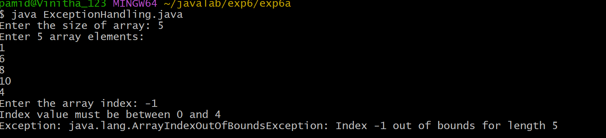
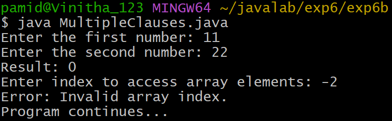
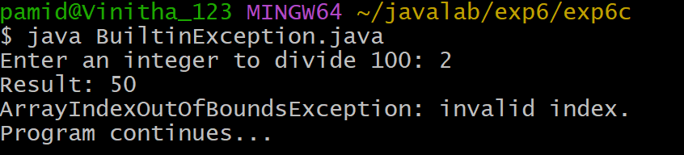
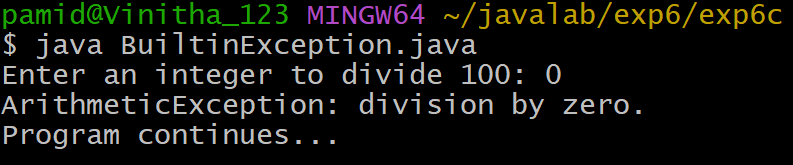

# EXPERIMENT-6
## 6a)Title: Exception Handling Mechanism
## source code:
```java
import java.util.Scanner;
class ExceptionHandling {
    public static void main(String[] args) {
        Scanner sc = new Scanner(System.in);
        System.out.print("Enter the size of array: ");
        int size = sc.nextInt();
        int[] arr = new int[size];
        System.out.println("Enter " + size + " array elements:");
        for (int i = 0; i < size; i++) {
            arr[i] = sc.nextInt();
        }
        System.out.print("Enter the array index: ");
        int index = sc.nextInt();
        try {
            System.out.println("The value at array index is: " + arr[index]);
        }
        catch (ArrayIndexOutOfBoundsException e) {
            System.out.println("Index value must be between 0 and " + (size - 1));
            System.out.println("Exception: " + e);
        }
        sc.close();
    }
}
```
# output


## 6b)Title:Illustrating Mutlile catch clauses.
## Source code:
```java
import java.util.Scanner;
import java.util.InputMismatchException;
class MultipleCatchClauses {
    public static void main(String[] args) {
        Scanner sc = new Scanner(System.in);
        int[] arr = {10, 20, 30, 40, 50};
        try {
            System.out.print("Enter the first number: ");
            int a = sc.nextInt();
            System.out.print("Enter the second number: ");
            int b = sc.nextInt();
            int result = a / b;
            System.out.println("Result: " + result);
            System.out.print("Enter index to access array elements: ");
            int index = sc.nextInt();
            System.out.println("Element at index = " + arr[index]);
        }
        catch (ArithmeticException e) {
            System.out.println("Error: Division by zero is not allowed.");
        }
        catch (InputMismatchException e) {
            System.out.println("Error: Please enter numeric values only.");
        }
        catch (ArrayIndexOutOfBoundsException e) {
            System.out.println("Error: Invalid array index.");
        }
        System.out.println("Program continues...");
        sc.close();
}
}
```
# output


## 6c)Title:Creation of java Bulit-in Exception
## Source Code:
```java
import java.util.Scanner;
 class MultipleExceptionsDemo {
    public static void main(String[] args) {
        Scanner sc = new Scanner(System.in);
        try {
            System.out.print("Enter an integer to divide 100: ");
            int n = sc.nextInt();
            int result = 100 / n;
            System.out.println("Result: " + result);
            int[] arr = new int[3];
            System.out.println("Accessing element: " + arr[5]);
            System.out.print("Enter a number as text: ");
            sc.nextLine();
            String s = sc.nextLine();
            int num = Integer.parseInt(s);
            System.out.println("Converted number: " + num);
        }
        catch (ArithmeticException e) {
            System.out.println("ArithmeticException: division by zero.");
        }
        catch (ArrayIndexOutOfBoundsException e) {
            System.out.println("ArrayIndexOutOfBoundsException: invalid index.");
        }
        catch (NumberFormatException e) {
            System.out.println("NumberFormatException: invalid numeric format.");
        }
        catch (Exception e) {
            System.out.println("Some other exception occurred.");
        }

        System.out.println("Program continues...");
        sc.close();
    }
}
```
# output


