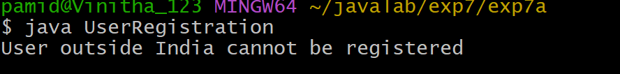

## EXPERIMENT-7
## 7a)Title: Creation of User Defined Exception.
## Source Code.
```java
class InvalidCountryException extends Exception {
  InvalidCountryException() {
    super();
  }
  InvalidCountryException(String message) {
    super(message);
  }
}
class userRegistration {
  void registerUser(String userName, String userCountry) throws InvalidCountryException {
      if(!userCountry.equals("India")) {
        throw new InvalidCountryException("User outside India cannot be registered");
      }
      else {
        System.out.println("User Registration Done Successfully");
      }
    }
    public static void main(String[] args) {
      userRegistration ur = new userRegistration();
      try {
        ur.registerUser("srilatha ", "russia");
      }
      catch(InvalidCountryException e) {
        System.out.println(e.getMessage());
    }
  }
}
```
# output.
# 
